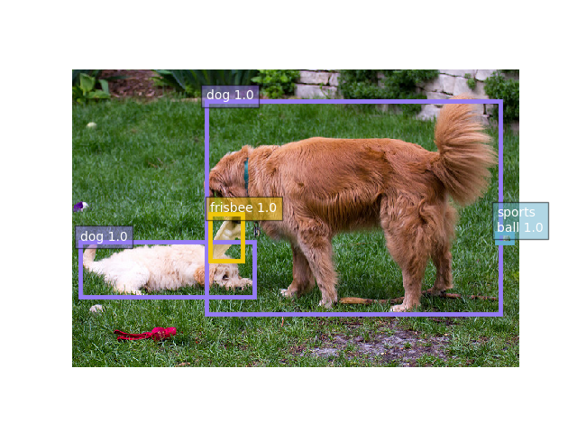

# SNIPER: Efficient Multi-Scale Training

<p align="center">

 </p>

SNIPER is an efficient multi-scale training approach for instance-level recognition tasks like object detection and instance-level segmentataion. 
Instead of processing all pixels in an image pyramid, SNIPER selectively processes context regions around the ground-truth objects (a.k.a *chips*).
This significantly speeds up multi-scale training as it operates on low-resolution chips. 
Due to its memeory efficient design, SNIPER can benefit from *Batch Normalization* during training and it makes larger batch-sizes possible for instance-level recognition tasks on a single GPU. Hence, we do not need to synchronize batch-normalization statistics across GPUs and we can train object detectors similar to the way we do image classification!

[SNIPER](https://arxiv.org/abs/1805.09300) is described in the following paper:
<pre>
<b>SNIPER: Efficient Multi-Scale Training</b>
<b>Bharat Singh*, Mahyar Najibi*, and Larry S. Davis (* denotes equal contribution)</b>
<b>arXiv preprint arXiv:1805.09300, 2018.</b>
</pre>

### Features
1. Train with a batch size of 160 images with a ResNet-101 backbone on 8 V100 GPUs
2. NO PYTHON LAYERS (Every layer is optimized for large batch sizes in CUDA/C++)
3. HALF PRECISION TRAINING with no loss in accuracy
4. 5 Images/second during inference on a single V100 GPU, 47.6/68.5 on COCO without training on segmentation masks
5. The R-FCN-3K branch is also powered by SNIPER. Now 21% better than YOLO-9000 on ImageNetDet. This branch also supports on-the-fly training (in seconds) with very few samples (no bounding boxes needed!)
6. Train on OpenImagesV4 (14x bigger than COCO) with ResNet-101 in 3 days on a p3.x16.large AWS instance! 

### Citing
```
@article{sniper2018,
  title={{SNIPER}: Efficient Multi-Scale Training},
  author={Singh, Bharat and Najibi, Mahyar and Davis, Larry S},
  journal={arXiv preprint arXiv:1805.09300},
  year={2018}
}
```

### Contents
1. [Installation](#install)
2. [Running the demo](#demo)
2. [Training a model with SNIPER](#training)
3. [Evaluting a trained model](#evaluating)
4. [Other methods and branches in this repo (R-FCN-3K, open-images)](#others)

<a name="install"> </a>
### Installation
1. Clone the repository:
```
git clone --recursive https://github.com/mahyarnajibi/SNIPER.git
```

2. Compile the provided mxnet fork in the repository:
```
cd SNIPER-mxnet
mkdir build
cd build
cmake ..
make
```

3. Add mxnet to the ```PYTHONPATH```:
```
export PYTHONPATH=SNIPER-mxnet/python:$PYTHONPATH
```

4. Install the required python packages:
```
pip install -r requirements.txt
```

<a name="demo"> </a>
### Running the demo
For running the demo, you need to download the provided SNIPER model. The following script downloads the SNIPER model and extracts it into the default location:
```
bash download_sniper_detector.sh
```
After downloading the model, the following command would run the SNIPER detector with the default configs on the provided sample image:
```
python demo.py
```
If everything goes well you should be able to see the following detections:
<p align="center">

 </p>
 
You can also run the detector on an arbitray image by providing its path to the script:
```
python demo.py --im_path [PATH to the image]
```

<a name="training"></a>
### Training a model
For training SNIPER on COCO, you would need to download the pre-trained models, the pre-computed proposals used for negative chip mining
(you can also use any other set of proposals), and configure the dataset as described below.

*Downloading pre-trained models*

Running the following script downloads and extract the pre-trained models into the default path (```data/pretrained_model```):
```
bash download_imgnet_models.sh
```

*Downloading pre-computed proposals for negative chip mining*

Running the following script downloads and extract the pre-computed proposals into the default path (```data/proposals```):
```
bash download_sniper_neg_props.sh
```

*Configuring the COCO dataset*

Please follow the [official COCO dataset website](http://cocodataset.org/#download) to download the dataset. After downloading
the dataset you should have the following directory structure:
 ```
data
   |--datasets
         |--coco
            |--annotations
            |--images
```

To train a model with SNIPER and default parameters you can call the following script:
```
python main_train.py
```
The default settings can be overwritten by passing a configuration file (see the ```configs``` folder for example configuration files).
The path to the configuration file can be passed as an argument to the above script with the ```--cfg``` flag .


<a name="evaluating"></a>
### Evaluating a trained model
*Evaluating the provided SNIPER models*

The repository provides a set of pre-trained SNIPER models which can be downloaded by running the following script:
```
bash download_sniper_detector.sh
```
This script downloads the model weights and extracts them into ```data/sniper_models```. 
To evaluate these models on coco dataset with the default configuration you can run the following script:

```
python main_test.py --weight_path [PATH TO THE DOWNLOADED WEIGHTS]
```
The default settings can be overwritten by passing the path to a configuration file with the ```--cfg``` flag 
(See the ```configs``` folder for examples). 

*Evaluating a model trained with this repository*

For evaluating a model trained with this repository, you can run the following script with the same configuration file used during the training.
The test settings can be set by updating the ```TEST``` section of the configuration file (See the ```configs``` folder for examples).
```
python main_test.py --cfg [PATH TO THE CONFIG FILE USED FOR TRAINING]
```
This would produce ```json``` file containing the detections on the ```test-dev``` which can be zipped and uploaded to the COCO evaluation server.

<a name="others"></a>
### Other methods and branches in this repo (RFCN-3K, open-images)
This repo also contains branches which implement the [R-FCN-3k](https://arxiv.org/abs/1712.01802), and modules to train and evaluate on the [open-images dataset](https://storage.googleapis.com/openimages/web/index.html). 
Please switch to the [3k](https://github.com/mahyarnajibi/CRCNN/tree/3k) and [openimages](https://github.com/mahyarnajibi/CRCNN/tree/openimages2) branches for specific instructions.
